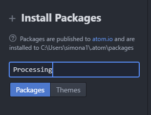

Installing and configuring Atom on your home Windows computer
=============================

To duplicate the Atom configuration we use at school on your home computer you will need to install several different programs and configure the Windows path variable.

Install Processing
------------------
1. Download [Processing](https://processing.org/download/?processing). On the school computers we are using the 64 bit version of Processing 3
2. Extract the compressed folder. It will be named something like `processing-3.3.4-windows64.zip`. One way is to right click on the folder and choose *Extract All*
3. The extracted folder will have a name like `processing-3.3.4`. Move the folder to a convenient location. One place might be `C:\Program Files`.

Install GitBash
---------------
1. Go to [https://git-scm.com/downloads](https://git-scm.com/downloads) and click on *Windows* under *Downloads*.
2. Double click the downloaded file. It will have a name like `Git-2.14.1-64-bit.exe`.
3. Click *Yes* to run the installer
4. The default configuration works fine, you can click *Yes* or *Next* whenever prompted

Install Atom and the Processing Package
---------------
1. Go to [https://atom.io/](https://atom.io/) and download Atom for Windows. 
2. Double click the downloaded file. It will have a name like `AtomSetup-x64.exe`.
3. Click *Yes* to the prompt *Register as default atom:// URI handler?*   
   
4. Then click on *Install a Package*   
   
5. Click on *Open Installer*   
   
6. Type *Processing* in the field under *Install Packages* and click *Packages*   
   
7. The first option should say something like *Run Processing sketches in Atom*. Click on *Install*   
   

Open and Run a Processing Program
---------------
1. Choose *File | Open Folder*
2. To run the program press *Alt+Ctrl+B* or *Packages | Processing | Run*
   

Configure Atom
---------------
1. Choose *Edit | Select Grammar*
  
2. Choose *Java*   
  

